<div align="center">


<h1>Network Landing Zone</h1>

<p><strong>The Institutional-Grade Platform for Multi-Cloud Hub-and-Spoke Networking, Transit Routing, and Zero Trust Architecture</strong></p>

[]()
[]()
[]()
[]()

<br/>

> **"Secure connectivity is the foundation of cloud adoption."** 
> Network Landing Zone is a flagship solution for Cloud Architects, Network Engineers, and Security Teams. By orchestrating a standardized Hub-and-Spoke architecture, centralized transit routing, and policy-as-code firewalling, it provides a scalable, secure, and observable foundation for all enterprise workloads across AWS, Azure, and GCP.

</div>

---

## 🏛️ Executive Summary

The **Network Landing Zone Platform** is a specialized flagship solution designed for Global Enterprises, Financial Institutions, and Regulated Industries. As organizations migrate critical workloads to the cloud, flat networks and point-to-point connections lead to unmanageable complexity, security breaches, and routing loops. This platform addresses these challenges using an "Architecture-First" framework.

This platform provides a **Centralized Cloud Network Hub**. It demonstrates how to orchestrate institutional cloud networking—using **FastAPI**, **React 18**, **Terraform**, and **Transit Gateways**—to create a "Secure-by-Default" topology. By providing **Hub-and-Spoke Isolation**, **Centralized Inspection**, **Cross-Cloud Peering**, and **Automated IPAM**, it enables organizations to deploy hundreds of isolated spoke networks that securely communicate through a governed central hub.

---

## 📉 The "Spaghetti Network" Problem

Enterprises scaling cloud footprints without a Landing Zone face existential challenges:
- **Topology Chaos**: Point-to-point VPC peering creates an unmanageable N*(N-1)/2 mesh network that is impossible to secure or audit.
- **Security Blind Spots**: Lack of centralized traffic inspection (North/South and East/West) allows lateral movement in the event of a breach.
- **IP Overlap**: Decentralized network creation inevitably leads to overlapping CIDR blocks, preventing future connectivity.
- **Multi-Cloud Islands**: Inability to establish standardized, secure, high-bandwidth connections between AWS, Azure, GCP, and on-premises datacenters.

---

## 🚀 Strategic Drivers & Business Outcomes

### 🎯 Strategic Drivers
- **Standardized Hub-and-Spoke Topology**: Enforcing a strict topology where all traffic routes through a central, highly governed Hub.
- **Centralized Security Inspection**: Forcing all inter-spoke (East/West) and internet (North/South) traffic through Next-Gen Firewalls (NGFW).
- **Global Transit Architecture**: Utilizing Transit Gateways / Virtual WANs to simplify routing and enable multi-region connectivity.

### 💰 Business Outcomes
- **100% Policy Enforcement**: Guaranteeing that no network traffic bypasses security inspection controls.
- **Zero IP Conflict**: Centralized IP Address Management (IPAM) ensures scalable allocation across the entire enterprise.
- **Rapid Spoke Provisioning**: Reducing the time to provision a secure, connected application network from weeks to minutes.

---

## 📐 Architecture Storytelling: 80+ Advanced Diagrams

### 1. Executive Hub-and-Spoke Architecture
*The global flow of network traffic through the central inspection hub.*
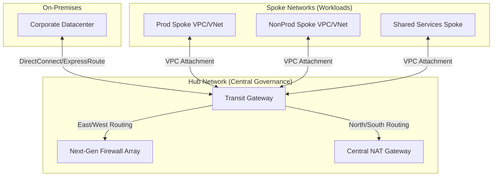

### 2. Traffic Inspection Flow (East/West)
*How inter-spoke traffic is forced through security inspection.*
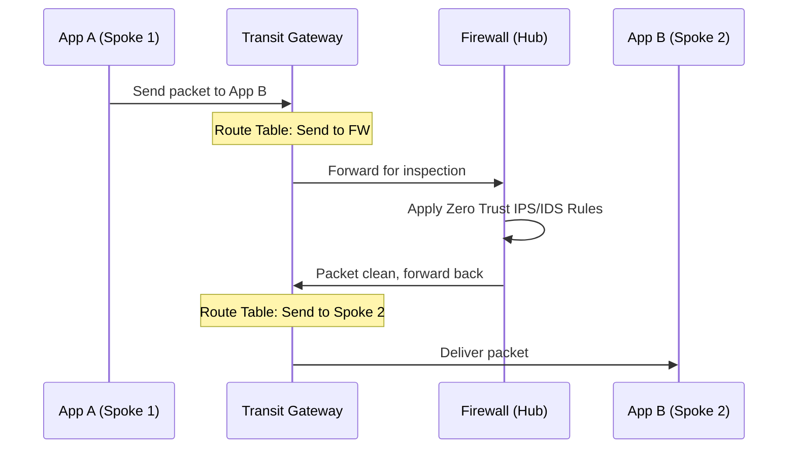

### 3. Multi-Cloud Transit Connectivity
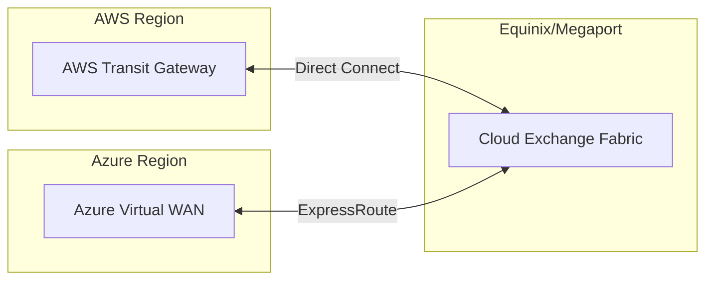

### 4. Zero Trust Network Segmentation
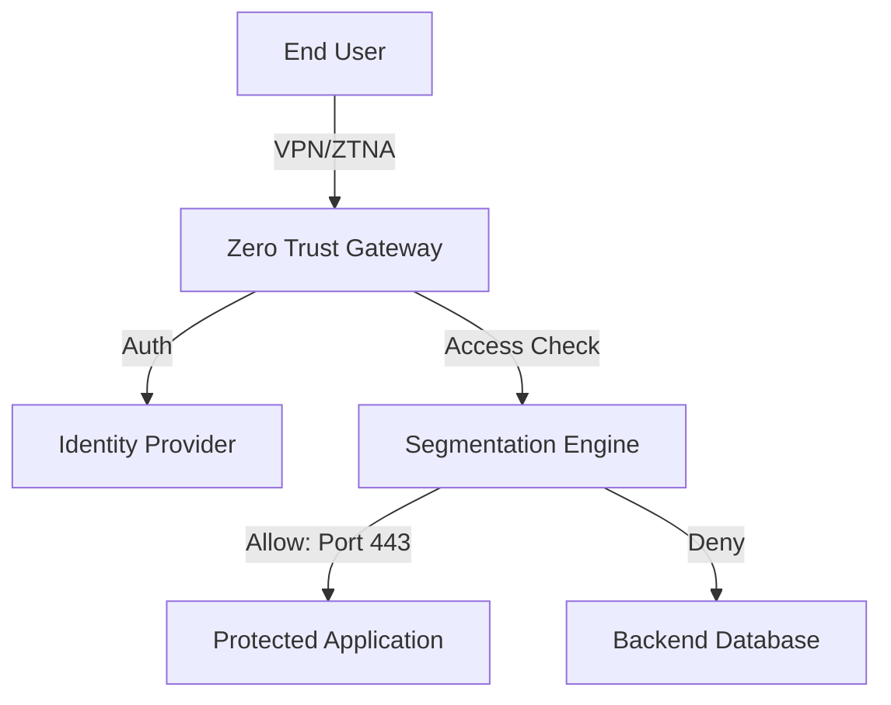

### 5. Private DNS Resolution Architecture
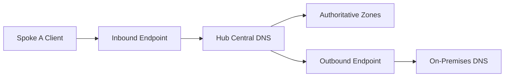

### 6. Network Provisioning Automation
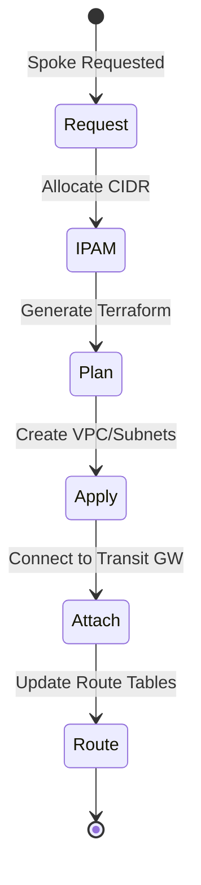

### 7. Multi-Region Failover Architecture
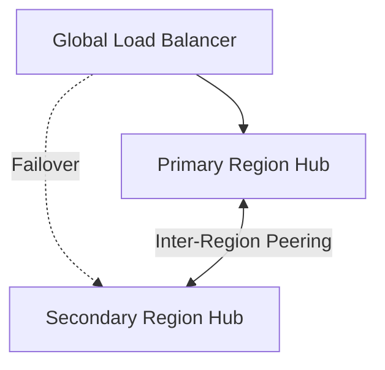

### 8. Global Audit & Drift Detection
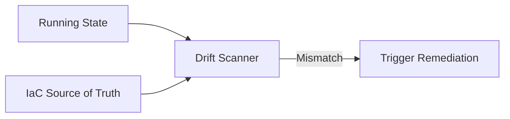

### 9. Micro-segmentation Enforcer
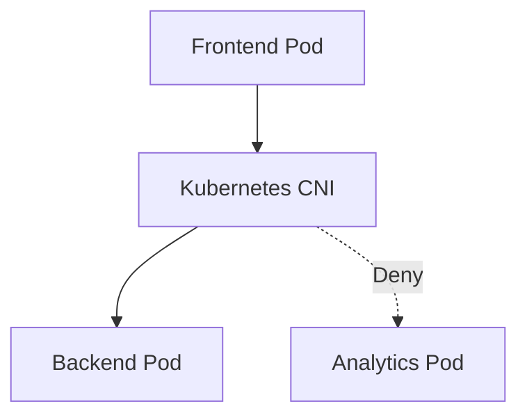

### 10. Executive Network Dashboard
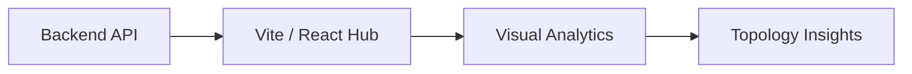

### 11. Network landing zone flow
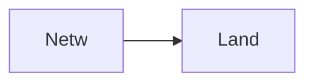

### 12. Hub and spoke model
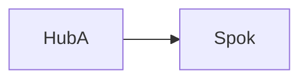

### 13. Transit gateway routing
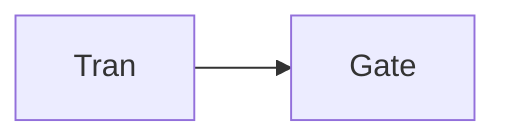

### 14. VPC attachment lifecycle
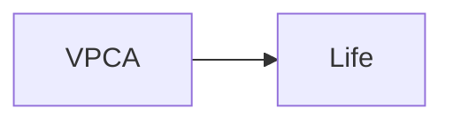

### 15. Ingress traffic flow
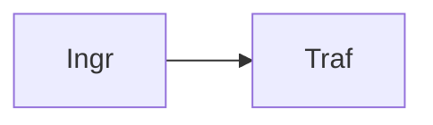

### 16. Egress traffic flow
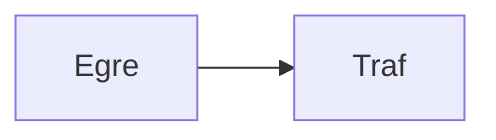

### 17. Firewall inspection loop
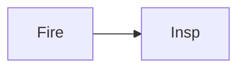

### 18. Policy-as-code deployment
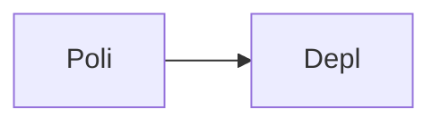

### 19. IPAM allocation flow
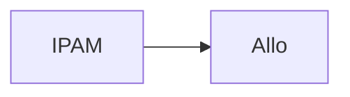

### 20. Route table propagation
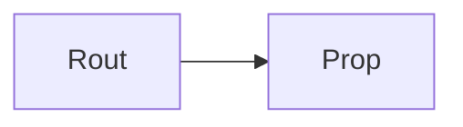

### 21. Multi-cloud peering
```mermaid
graph LR
    M[Mult] --> P[Peer]
```

### 22. VPN IPSec tunnel setup
```mermaid
graph LR
    V[VPN] --> I[IPSe]
```

### 23. Private link endpoint
```mermaid
graph LR
    P[Priv] --> L[Link]
```

### 24. DNS forwarding rules
```mermaid
graph LR
    D[DNS] --> F[Forw]
```

### 25. Shared services connectivity
```mermaid
graph LR
    S[Shar] --> C[Conn]
```

### 26. Segmentation policy check
```mermaid
graph LR
    S[Segm] --> P[Poli]
```

### 27. High availability design
```mermaid
graph LR
    H[High] --> A[Avai]
```

### 28. Infrastructure: Hub Network
```mermaid
graph LR
    I[Infr] --> H[HubN]
```

### 29. Infrastructure: Spoke Network
```mermaid
graph LR
    I[Infr] --> S[Spok]
```

### 30. Infrastructure: Transit
```mermaid
graph LR
    I[Infr] --> T[Tran]
```

### 31. Infrastructure: Kubernetes
```mermaid
graph LR
    I[Infr] --> K[Kube]
```

### 32. Monitoring: Prometheus
```mermaid
graph LR
    M[Moni] --> P[Prom]
```

### 33. Monitoring: Grafana
```mermaid
graph LR
    M[Moni] --> G[Graf]
```

### 34. Monitoring: Alerts
```mermaid
graph LR
    M[Moni] --> A[Aler]
```

### 35. CI/CD: Build pipeline
```mermaid
graph LR
    C[CICD] --> B[Buil]
```

### 36. CI/CD: Test pipeline
```mermaid
graph LR
    C[CICD] --> T[Test]
```

### 37. CI/CD: Deploy pipeline
```mermaid
graph LR
    C[CICD] --> D[Depl]
```

### 38. Frontend: Dashboard
```mermaid
graph LR
    F[Fron] --> D[Dash]
```

### 39. Frontend: Topology Map
```mermaid
graph LR
    F[Fron] --> T[Topo]
```

### 40. Frontend: Security Rules
```mermaid
graph LR
    F[Fron] --> S[Secu]
```

### 41. API: Auth flow
```mermaid
graph LR
    A[API] --> A[Auth]
```

### 42. API: Network list
```mermaid
graph LR
    A[API] --> N[Netw]
```

### 43. API: Routing tables
```mermaid
graph LR
    A[API] --> R[Rout]
```

### 44. API: Policy status
```mermaid
graph LR
    A[API] --> P[Poli]
```

### 45. Worker: Provisioning
```mermaid
graph LR
    W[Work] --> P[Prov]
```

### 46. Worker: Validation
```mermaid
graph LR
    W[Work] --> V[Vali]
```

### 47. Worker: Audit
```mermaid
graph LR
    W[Work] --> A[Audi]
```

### 48. Worker: Policy
```mermaid
graph LR
    W[Work] --> P[Poli]
```

### 49. Blueprint: Prod Spoke
```mermaid
graph LR
    B[Blue] --> P[Prod]
```

### 50. Blueprint: Dev Spoke
```mermaid
graph LR
    B[Blue] --> D[Dev]
```

### 51. Workflow: Create Spoke
```mermaid
graph LR
    W[Work] --> C[Crea]
```

### 52. Workflow: Route Update
```mermaid
graph LR
    W[Work] --> R[Rout]
```

### 53. Policy: Egress filtering
```mermaid
graph LR
    P[Poli] --> E[Egre]
```

### 54. Integration: AWS CloudWAN
```mermaid
graph LR
    I[Inte] --> A[AWS]
```

### 55. Integration: Azure vWAN
```mermaid
graph LR
    I[Inte] --> A[Azur]
```

### 56. Script: Provision Hub
```mermaid
graph LR
    S[Scri] --> P[Prov]
```

### 57. Script: Validate Topology
```mermaid
graph LR
    S[Scri] --> V[Vali]
```

### 58. Script: Enforce Rules
```mermaid
graph LR
    S[Scri] --> E[Enfo]
```

### 59. Security: Network ACLs
```mermaid
graph LR
    S[Secu] --> N[NetA]
```

### 60. Security: Traffic Mirroring
```mermaid
graph LR
    S[Secu] --> T[Traf]
```

### 61. Metrics tracking: Provision Time
```mermaid
graph LR
    M[Metr] --> P[Prov]
```

### 62. Metrics tracking: Latency
```mermaid
graph LR
    M[Metr] --> L[Late]
```

### 63. Network intent map
```mermaid
graph LR
    N[Netw] --> I[Inte]
```

### 64. KPI tracking: Uptime
```mermaid
graph LR
    K[KPI] --> U[Upti]
```

### 65. KPI tracking: Drift
```mermaid
graph LR
    K[KPI] --> D[Drif]
```

### 66. Optimization roadmap
```mermaid
graph LR
    O[Opti] --> R[Road]
```

### 67. Value realization
```mermaid
graph LR
    V[Valu] --> R[Real]
```

### 68. Institutional maturity
```mermaid
graph LR
    I[Inst] --> M[Matu]
```

### 69. Strategy execution
```mermaid
graph LR
    S[Stra] --> E[Exec]
```

### 70. Ecosystem map
```mermaid
graph LR
    E[Ecos] --> M[Map]
```

### 71. Supply chain of intent
```mermaid
graph LR
    S[Supp] --> I[Inte]
```

### 72. Landing zone blueprint
```mermaid
graph LR
    L[Land] --> B[Blue]
```

### 73. Zero trust model map
```mermaid
graph LR
    Z[Zero] --> M[Map]
```

### 74. Transformation roadmap
```mermaid
graph LR
    T[Tran] --> R[Road]
```

### 75. Value realization model
```mermaid
graph LR
    V[Valu] --> R[Real]
```

### 76. Governance audit trail
```mermaid
graph LR
    G[Govn] --> A[Audi]
```

### 77. Security RBAC flow
```mermaid
graph LR
    S[Secu] --> R[RBAC]
```

### 78. Compliance validation
```mermaid
graph LR
    C[Comp] --> V[Vali]
```

### 79. Network boundary check
```mermaid
graph LR
    N[Netw] --> B[Boun]
```

### 80. Executive summary hub
```mermaid
graph LR
    E[Exec] --> H[Hub]
```

---

## 🛠️ Technical Stack & Implementation

### Orchestration & Routing Engine
- **Processing**: Python 3.11+ / FastAPI.
- **Topology**: Transit Gateway (AWS), Virtual WAN (Azure), Cloud Router (GCP).
- **Security**: Policy-as-Code Network Firewalls and Security Groups.

### Frontend (Landing Zone Command Center)
- **Framework**: React 18 / Vite
- **Visuals**: Recharts (Network Lifecycles, Topology Maps, Compliance States).
- **Theme**: Dark, Teal, and Slate (Institutional Cloud Networking Aesthetics).

### Infrastructure
- **Cloud**: Multi-Cloud (AWS, Azure, GCP), AWS EKS (Runtime), RDS (Persistence).
- **IaC**: Terraform (VPC, TGW, Route Tables, VPN, DNS, IAM).

---

## 🚀 Deployment Guide

### Local Development
```bash
# Clone the repository
git clone https://github.com/devopstrio/network-landingzone.git
cd network-landingzone

# Setup environment
cp .env.example .env

# Launch the landing zone orchestration stack
make up
```
Access the Hub Dashboard at `http://localhost:3000`.

---

## 📜 License
Distributed under the MIT License. See `LICENSE` for more information.
