<div align="center">


<h1>Network Landing Zone</h1>

<p><strong>The Institutional-Grade Platform for Multi-Cloud Hub-and-Spoke Networking, Transit Routing, and Zero Trust Architecture.</strong></p>

[]()
[]()
[]()

<br/>

> **"Secure connectivity is the foundation of cloud adoption."** 
> **Network Landing Zone** is an enterprise-grade platform designed to provide a secure, measurable, and highly automated foundation for global cloud networking. It orchestrates the complex lifecycle of network infrastructure—from multi-cloud Hub-and-Spoke provisioning and centralized transit routing to automated IPAM and unified zero-trust governance.

</div>

---

## 🏛️ Executive Summary

Fragmented cloud networks and manual routing configurations are strategic operational liabilities; lack of a standardized network landing zone is a primary barrier to organizational agility. Organizations fail to scale their cloud presence not because of a lack of bandwidth, but because of fragmented topology standards, lack of centralized security inspection, and an inability to orchestrate connectivity with operational precision.

This platform provides the **Transit Intelligence Plane**. It implements a complete **Enterprise Network-as-Code Framework**, enabling Network and Platform teams to manage global connectivity as a first-class citizen. By automating the provisioning of isolated spoke networks and orchestrating real-time security edge guardrails, we ensure that every organizational asset—from public-facing web applications to backend financial databases—is connected by default, audited for history, and strictly aligned with institutional cloud adoption frameworks.

---

## 📐 Architecture Storytelling: Principal Reference Models

### 1. Principal Architecture: Global Network Landing Zone & Transit Intelligence Plane
This diagram illustrates the end-to-end flow from multi-cloud Hub provisioning and spoke connectivity to centralized security inspection, routing, and institutional network auditing.

```mermaid
graph LR
    %% Subgraph Definitions
    subgraph HubNetwork["Central Transit Hub"]
        direction TB
        TGW["Transit Gateway / vWAN"]
        NGFW["Next-Gen Firewalls"]
        NAT["Central NAT Gateway"]
    end

    subgraph IntelligenceEngine["Transit Intelligence Hub"]
        direction TB
        API["FastAPI Network Gateway"]
        IPAM["IPAM & CIDR Allocator"]
        RouteMgr["Routing & Peering Manager"]
        DNS["Central DNS Resolver"]
    end

    subgraph SpokeNetworks["Workload Spoke Fleet"]
        direction TB
        Prod["Prod Spoke VPC/VNet"]
        NonProd["Non-Prod Spoke VPC/VNet"]
        Shared["Shared Services Spoke"]
    end

    subgraph OperationsHub["Institutional Network Hub"]
        direction TB
        Scorecard["Network Maturity Score"]
        Analytics["Latency & Throughput Stats"]
        Audit["Forensic Network Metadata Lake"]
    end

    subgraph DevOps["Network-as-Code Orchestration"]
        direction TB
        TF["Terraform Network Modules"]
        GitOps["GitOps Connectivity Sync"]
        ChatOps["ChatOps Approval Hub"]
    end

    %% Flow Arrows
    SpokeNetworks -->|1. Request Attachment| API
    API -->|2. Allocate CIDR| IPAM
    IPAM -->|3. Provision Transit| HubNetwork
    HubNetwork -->|4. Inspect Traffic| NGFW
    
    NGFW -->|5. Route to Destination| SpokeNetworks
    API -->|6. Resolve Names| DNS
    DNS -->|7. Sync Records| SpokeNetworks
    
    API -->|8. Visualize Health| Scorecard
    Scorecard -->|9. Track Cost| Analytics
    Scorecard -->|10. Record Event| Audit
    
    TF -->|11. Provision Hub| IntelligenceEngine
    GitOps -->|12. Deploy Spokes| SpokeNetworks
    Audit -->|13. Improve Topology| HubNetwork

    %% Styling
    classDef hub fill:#f5f5f5,stroke:#616161,stroke-width:2px;
    classDef intel fill:#e0f2f1,stroke:#004d40,stroke-width:2px;
    classDef spokes fill:#e1f5fe,stroke:#01579b,stroke-width:2px;
    classDef ops fill:#ede7f6,stroke:#311b92,stroke-width:2px;
    classDef devops fill:#fffde7,stroke:#f57f17,stroke-width:2px;

    class HubNetwork hub;
    class IntelligenceEngine intel;
    class SpokeNetworks spokes;
    class OperationsHub ops;
    class DevOps devops;
```

### 2. The Network LZ Lifecycle Flow
The continuous path of a landing zone from initial design and provisioning to active connection, security enforcement, and institutional forensic auditing.

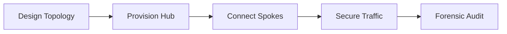

### 3. Hub-and-Spoke Global Transit Topology
Strategic centralization of multi-region connectivity in a "Hub" network, providing a single transit point for all inter-spoke and hybrid cloud traffic.

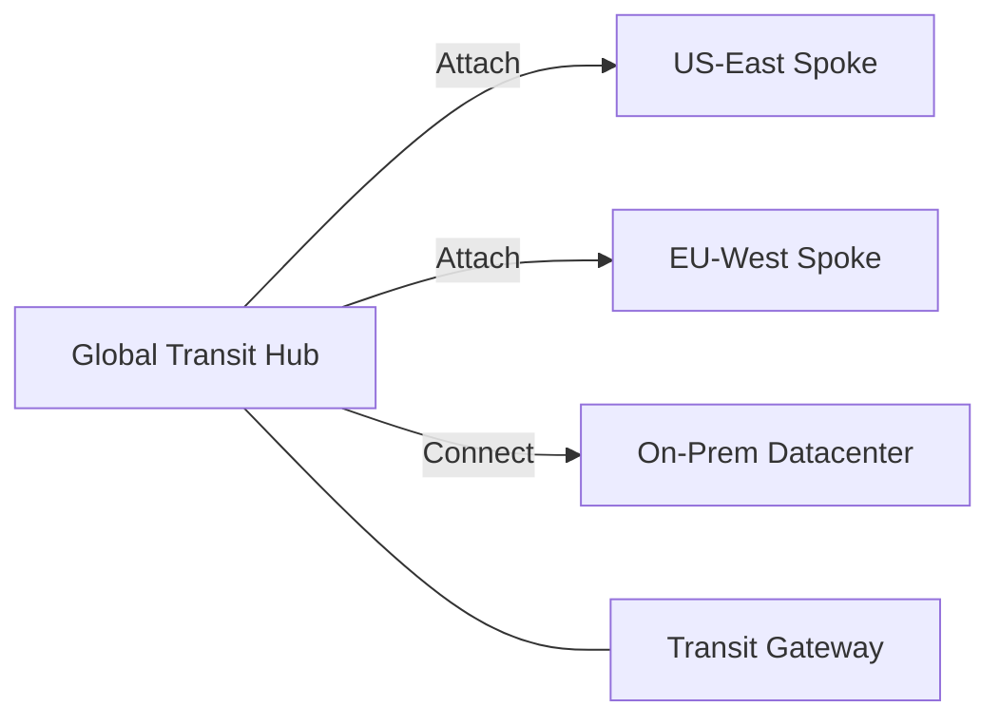

### 4. Security Edge & DMZ Architecture
Standardizing the implementation of Web Application Firewalls (WAF), Next-Gen Firewalls (NGFW), and Ingress Controllers at the network edge to ensure consistent protection.

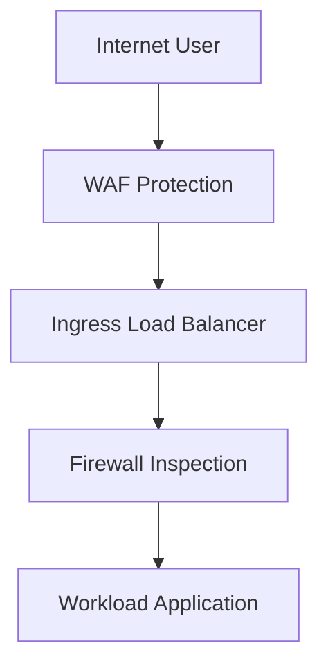

### 5. Private Link & Service Provider Mesh
Securely exposing internal services across the landing zone using Private Link endpoints, eliminating the need for complex VPC peering or public IP exposure.

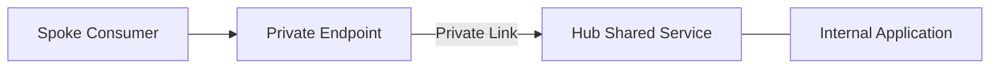

### 6. Hybrid Cloud Connectivity (VPN/Direct Connect)
Orchestrating high-bandwidth, low-latency connections between institutional on-premises datacenters and the cloud backbone using managed VPN and Direct Connect/ExpressRoute.

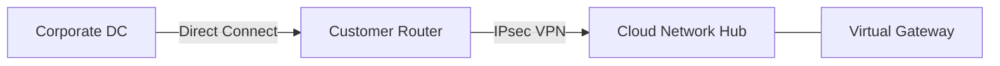

### 7. Institutional Network LZ Scorecard
Grading organizational performance based on key indicators: Network Availability, Segment Isolation, and Bandwidth Cost Efficiency.

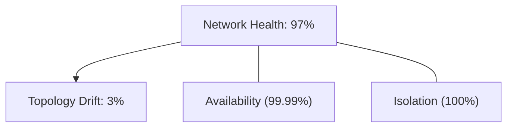

### 8. Identity & RBAC for Network Governance
Managing fine-grained access to transit routing tables, firewall policies, and peering connections between Network Architects, Spoke Owners, and Security Auditors.

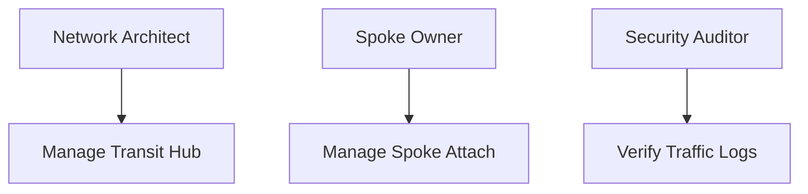

### 9. IaC Deployment: Network-as-Code Framework
Using modular Terraform to deploy and manage the versioned distribution of the network hubs, transit gateways, and forensic metadata lakes.

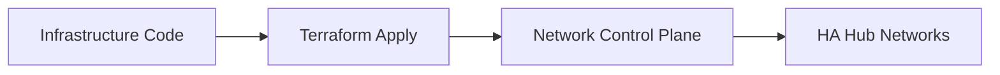

### 10. Automated Subnet & IPAM Orchestration Flow
Managing the dynamic allocation of CIDR blocks and subnets across thousands of workload spokes, ensuring zero IP overlap and optimal address utilization.

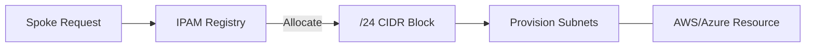

### 11. Metadata Lake for Forensic Connectivity Audit
Storing long-term records of every route change, peering event, and firewall policy update for institutional record-keeping, compliance auditing, and post-breach forensics.

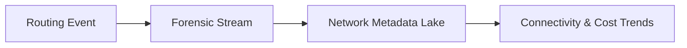

---

## 🏛️ Core Networking Pillars

1.  **Standardized Hub-and-Spoke Topology**: Enforcing a consistent architectural pattern for all cloud environments.
2.  **Centralized Transit Routing**: Simplifying multi-cloud and multi-region connectivity through managed transit gateways.
3.  **Policy-Based Security Inspection**: Forcing all inter-segment traffic through centralized firewall clusters.
4.  **Automated IP Address Management**: Eliminating the risk of IP overlap through centralized CIDR orchestration.
5.  **Hybrid-Cloud Backbone Integration**: Seamlessly extending the corporate datacenter into the cloud network.
6.  **Full Connectivity Auditability**: Immutable recording of every route change and peering event for institutional forensics.

---

## 🛠️ Technical Stack & Implementation

### Network Engine & APIs
*   **Framework**: Python 3.11+ / FastAPI.
*   **Routing Core**: Native integration with AWS Transit Gateway, Azure vWAN, and GCP Cloud Router.
*   **IPAM Service**: Custom engine for orchestrating CIDR allocation and subnet management.
*   **Security Hub**: Orchestration of AWS Network Firewall, Azure Firewall, and Third-party NGFWs.
*   **Persistence**: PostgreSQL (Metadata Lake) and Redis (Routing Cache).

### Landing Zone Dashboard (UI)
*   **Framework**: React 18 / Vite.
*   **Theme**: Dark, Teal, Slate (Modern high-fidelity networking aesthetic).
*   **Visualization**: D3.js for topology mapping and Recharts for network performance trends.

### Infrastructure & DevOps
*   **Runtime**: AWS EKS or Azure Kubernetes Service (AKS).
*   **Connectivity**: Dedicated Direct Connect/ExpressRoute circuits with redundant VPN failover.
*   **IaC**: Modular Terraform for deploying the network hub and spoke distributions.

---

## 🏗️ IaC Mapping (Module Structure)

| Module | Purpose | Real Services |
| :--- | :--- | :--- |
| **`infrastructure/hub`** | Central transit plane | TGW, Firewall, VPN |
| **`infrastructure/spokes`** | Workload environment templates | VPC, Subnets, Peering |
| **`infrastructure/dns`** | Private DNS orchestration | Route53, Private Zones |
| **`infrastructure/auditing`** | Forensic connectivity sinks | S3, Athena, Quicksight |

---

## 🚀 Deployment Guide

### Local Principal Environment
```bash
# Clone the landing zone platform
git clone https://github.com/devopstrio/network-landingzone.git
cd network-landingzone

# Configure environment
cp .env.example .env

# Launch the Networking stack
make init

# Trigger a mock spoke provisioning and transit attachment simulation
make simulate-provisioning
```

Access the Network Dashboard at `http://localhost:3000`.

---

## 📜 License
Distributed under the MIT License. See `LICENSE` for more information.

---
<div align="center">
  <p>© 2026 Devopstrio. All rights reserved.</p>
</div>
