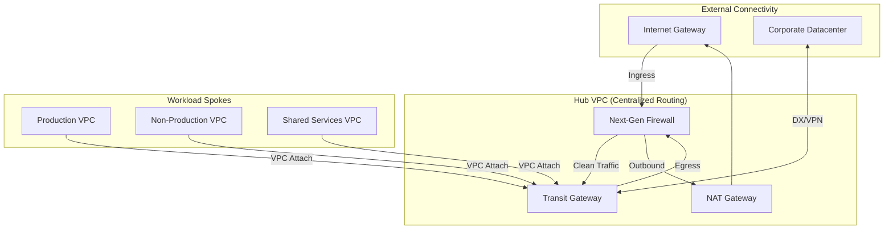
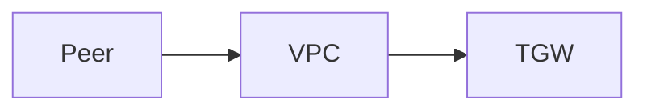
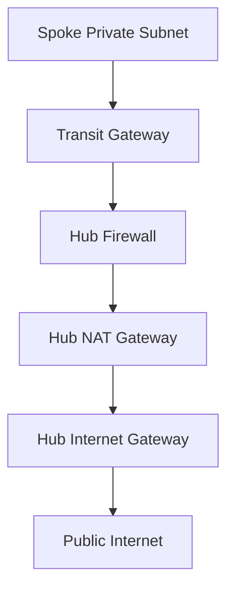

# Hub-and-Spoke Architecture Diagrams

## 11. Global Transit Architecture (Detailed)
*The core network routing flow between on-prem, hub, and spokes.*

## 15. Cross-VPC Peering vs Transit Gateway

## 20. Centralized Egress Flow

## 25. Shared Services DNS Resolution

