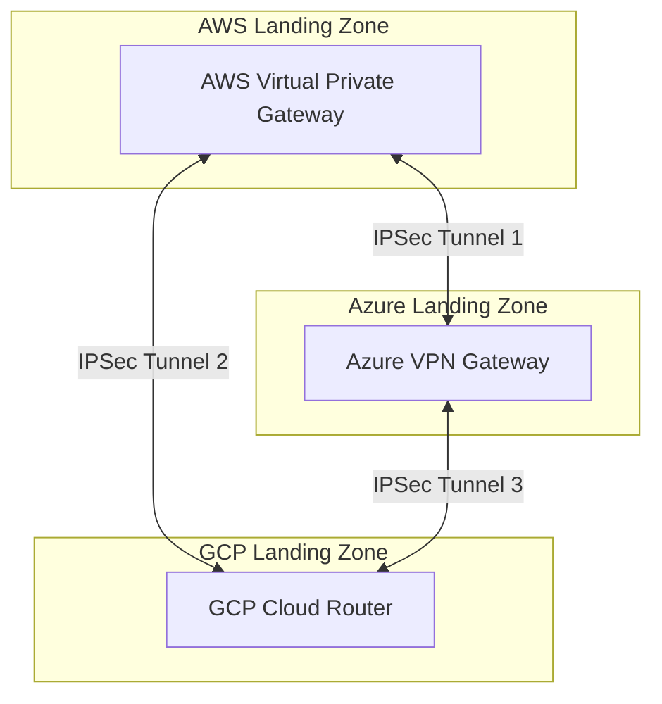
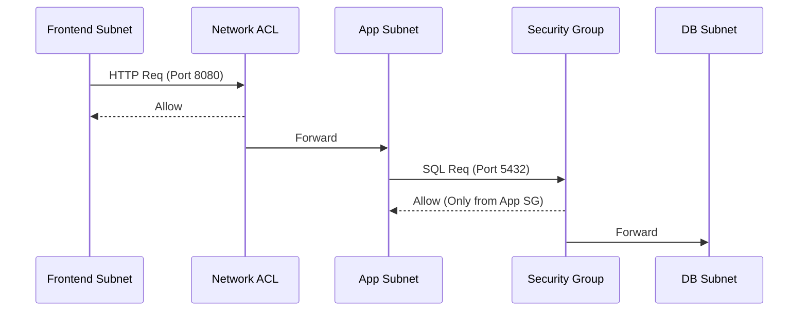
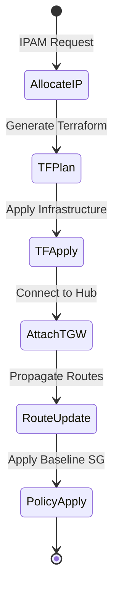

# Connectivity & Security Diagrams

## 31. Multi-Cloud VPN Architecture

```mermaid
graph TD
    subgraph "AWS Landing Zone"
        AWS_VGW[AWS Virtual Private Gateway]
    end
    subgraph "Azure Landing Zone"
        AZ_VNG[Azure VPN Gateway]
    end
    subgraph "GCP Landing Zone"
        GCP_CR[GCP Cloud Router]
    end

    AWS_VGW <-->|IPSec Tunnel 1| AZ_VNG
    AWS_VGW <-->|IPSec Tunnel 2| GCP_CR
    AZ_VNG <-->|IPSec Tunnel 3| GCP_CR
```

## 40. Zero Trust Segmentation Rules

```mermaid
sequenceDiagram
    participant Web as Frontend Subnet
    participant NACL as Network ACL
    participant App as App Subnet
    participant SG as Security Group
    participant DB as DB Subnet

    Web->>NACL: HTTP Req (Port 8080)
    NACL-->>Web: Allow
    NACL->>App: Forward
    App->>SG: SQL Req (Port 5432)
    SG-->>App: Allow (Only from App SG)
    SG->>DB: Forward
```

## 50. Spoke Provisioning Workflow

```mermaid
stateDiagram-v2
    [*] --> AllocateIP: IPAM Request
    AllocateIP --> TFPlan: Generate Terraform
    TFPlan --> TFApply: Apply Infrastructure
    TFApply --> AttachTGW: Connect to Hub
    AttachTGW --> RouteUpdate: Propagate Routes
    RouteUpdate --> PolicyApply: Apply Baseline SG
    PolicyApply --> [*]
```
